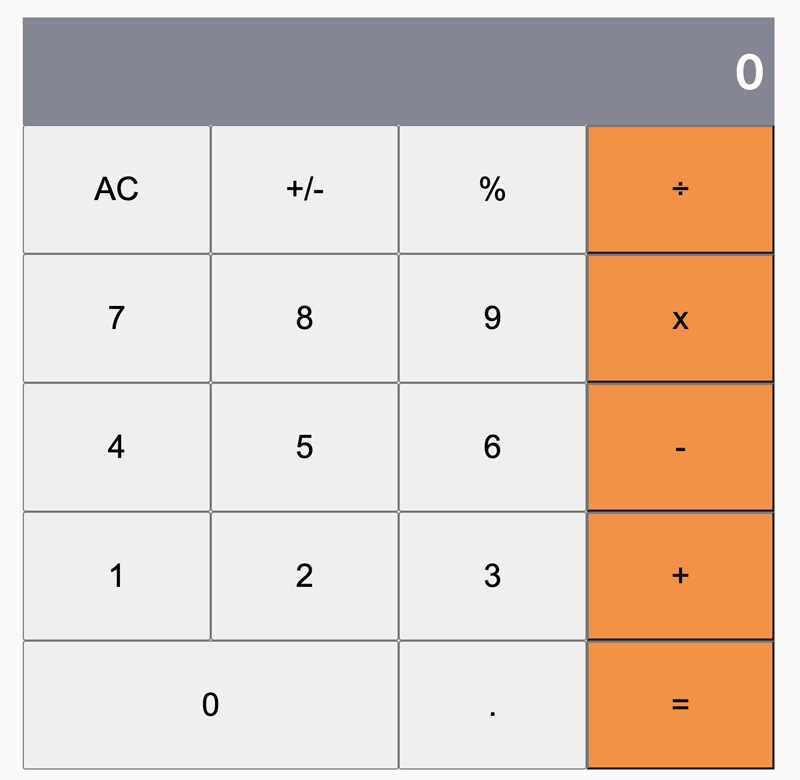

# Calculator App Using React

In this project, I developed a simple calculation app while I explored the basic components of React ranging from, 
- React App Setup
- React JSX,
- React Components,
- React States and Props
- Event Handlers
- React Routes
- Deploying React App to Heroku.
- React Testing using Jest 



## Live Demo
[Live Demo](https://calc-cush.herokuapp.com/)

## Getting Started

To get a local copy up and running follow these simple example steps.

### Prerequisites

Make sure Node.js is running on your local machine

### Setup

~~~bash
$ git clone https://github.com/acushlakoncept/react-calculator.git
$ cd react-calculator
~~~

Install modules:

```
yarn install
```

### Usage

Start server with:

```
    yarn start or npm start
```

### Deployment instructions

```
    git add .
    git commit -m "ready for first push to heroku"  
    heroku create $APP-NAME --buildpack mars/create-react-app
    git push heroku $BRANCH_NAME:master
```

Fire up your app by running `heroku open` Yay!!! your app has been deployed successfully.

# Authors

👤 **Uduak Essien**

- Github: [@acushlakoncept](https://github.com/acushlakoncept/)
- Twitter: [@acushlakoncept](https://twitter.com/acushlakoncept)
- Linkedin: [acushlakoncept](https://www.linkedin.com/in/acushlakoncept/)

## 🤝 Contributing

Contributions, issues and feature requests are welcome!

Feel free to check the [issues page](issues/).

## Show your support

Give a ⭐️ if you like this project!

## Acknowledgments
- [Microverse Inc](https://www.microverse.org/)
